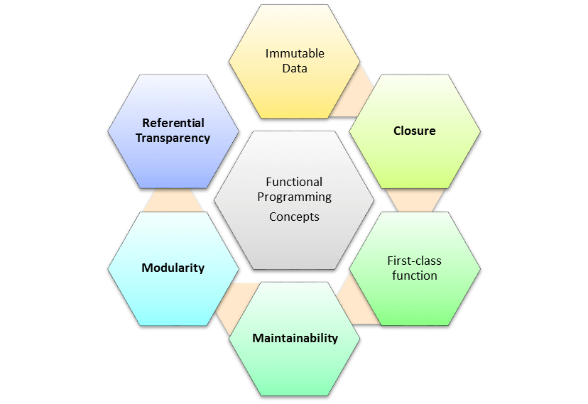

# **Functional Programming**
Jani Immonen, D571
jani.immonen@jamk.fi

&nbsp;
## **What is Functional programming?**

From [Wikipedia](https://en.wikipedia.org/wiki/Functional_programming)

In computer science, functional programming is a programming paradigm where programs are constructed by applying and composing functions. It is a declarative programming paradigm in which function definitions are trees of expressions that each return a value, rather than a sequence of imperative statements which change the state of the program.

In functional programming, functions are treated as first-class citizens, meaning that they can be bound to names (including local identifiers), passed as arguments, and returned from other functions, just as any other data type can. This allows programs to be written in a declarative and composable style, where small functions are combined in a modular manner.

Functional langauges empazies on expressions and declarations rather than execution of statements. Therefore, unlike other procedures which depend on a local or global state, value output in functional programming depends only on the arguments passed to the function.

&nbsp;
### **Functional Programming Languages**
Here are some most prominent Functional programming languages:
- [Haskell](https://www.haskell.org/)
- [SML](https://smlfamily.github.io/)
- [Clojure](https://clojure.org/)
- [Scala](https://scala-lang.org/)
- [Erlang/Elixir](https://elixir-lang.org/)
- [Clean](https://clean.cs.ru.nl/Clean)
- [F#](https://fsharp.org/)
- [Mathematica](https://www.wolfram.com/language/)
- SQL

&nbsp;
### **Terminology and Concepts**

&nbsp;

- Immutable Data
    - Data is not modified after it has been declared.
    - Create new data structures instead of modifying ones which is already exist.
- Referential transparency
    - Functional programs should perform operations just like as if it is for the first time. Its known what may or may not have happened during the program's execution, and its side effects.
- Modularity
    - Modular design increases productivity. Small modules can be implemented quickly and have a greater chance of re-use which leads to faster development time.
    - Modules can be tested separately which reduces the time spent on unit testing and debugging.
- Maintainability
    - Easier to maintain as its not possible to accidentally change anything outside the given function.
- First-class function
    - Attributed to programming language entities that have no restriction on their use. Therefore, first-class functions can appear anywhere in the program.
- Closure
    - The closure is an inner function which can access variables of parent function's, even after the parent function has executed.
- Higher-order functions
    - Functions either take other functions as arguments or return them as results.
- Pure function
    - Function whose inputs are declared as inputs and none of them should be hidden. The outputs are also declared as outputs.
    - Pure functions act on their parameters. Output is quaranteed to be the same with the given parameters.

Example:

    function Pure(a,b)
	    return a+b

- Impure functions
    - They have hidden inputs or output. Impure functions cannot be used or tested in isolation as they have dependencies.

Example:

    int z
    function notPure(a,b)
	    z = a+b+z

&nbsp;
### **The benefits of functional programming**
* Allows you to avoid confusing problems and errors in the code
* Easier to test and execute Unit testing and debug
* Parallel processing and concurrency
* Hot code deployment and fault tolerance
* Offers better modularity with a shorter code
* Increased productivity of the developer
* Supports Nested Functions

&nbsp;
### **Limitations of Functional Programming**
* Functional programming paradigm is not easy, it can be difficult to understand for the beginner
* Hard to maintain as many objects evolve during the coding
* Needs mocking and extensive environmental setup
* Re-use is complicated and needs constantly refactoring
* Objects may not represent the problem correctly

&nbsp;
## **Summary**
When starting functional programming, we are flooded with unfamiliar terms. Immutable data, first class functions, closures, which are language features that aid functional programming. Later we may hear about mapping, reducing, pipelining, recursing, currying and the use of higher order functions as a programming techniques used to write functional code. Not to stop there, we hear about concurrency, lazy evaluation, determinism, as advantageous properties of functional programs.

Most importantly, functional code is characterised by one thing: **the absence of side effects**. It doesn't rely on data outside the current function, and it doesn't change data that exists outside the current function. Every other *functional* thing can be derived from this property. Use it as a guide rope as you learn.

&nbsp;
----
**© Jani Immonen**

